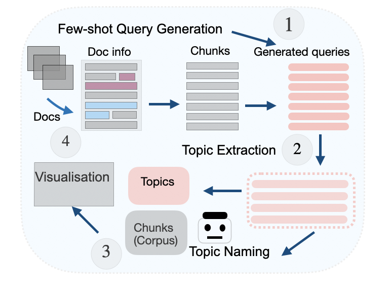
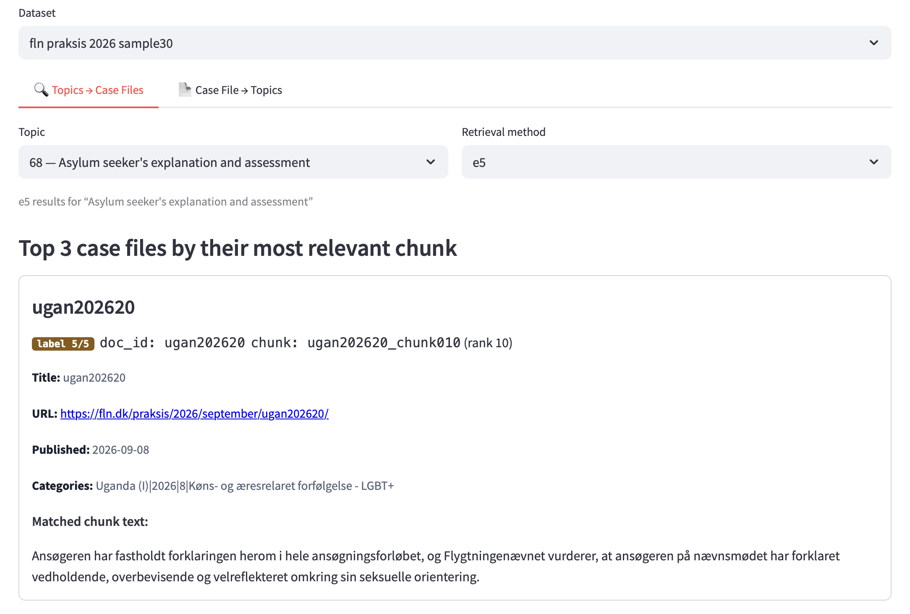
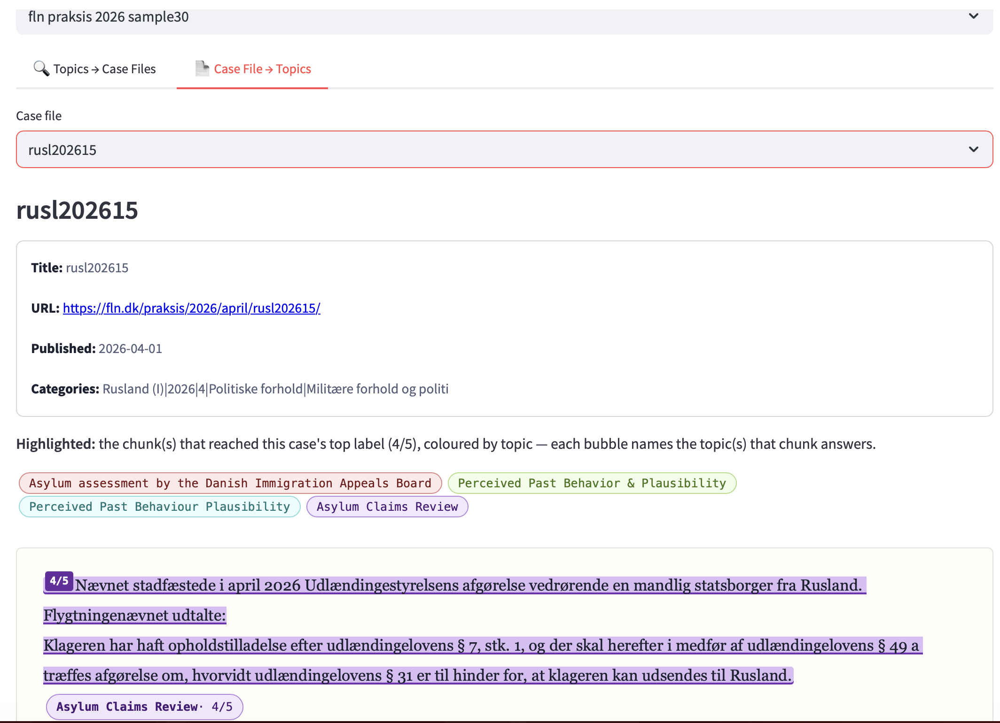

# actor
This repository presents the functionality of ACTOR: our Asylum Chunking Toolkit for Outcome Review. To reproduce the method mentioned in the paper and to further explore our system, we provide further details below: 


## Table of Contents
- [About the System](#about-the-system)
- [Supported Website Types](#supported-website-types)
- [Getting Started](#getting-started)
- [Pipeline with precomputed values](#pipeline-with-precomputed-values)
  - [Full Pipeline](#full-pipeline)
  - [Replace Own Data](#replace-own-data)
  - [Own Data Stepwise](#own-data-stepwise)
  - [Replace Own Qrels](#replace-own-qrels)
- [Visualisation](#visualisation)
  - [Topics to Case Files](#topics-to-case-files)
  - [Case Files to Topics](#case-files-to-topics)
  

## About the System
ACTOR consists of two main parts:
- A pipeline that obtains data from a website and computes the values by chunking, performing topic extraction, and topic-based retrieval.
- A visualisation tool that uses the precomputed values and displays results based on a mapping between chunk ids and document ids. A demonstration video of how we visualise our system and results is available at https://youtu.be/y-tmlT778Zs/. 

The architecture of our pipeline can be seen below. First, entire documents, each corresponding to a case file of an application decision summary, are chunked into smaller pieces. We use Few-shot Query Generation to generate one query per chunk using the few-shot examples in /prompts/fewshot_examples.txt. Second, We use Topic Extraction to produce a clustered version of the underlying semantic information contained in the generated queries. We use BERTopic to obtain query embeddings, reduce their dimensions, and cluster the embeddings into topics. We name these topics using Gemma3. At Step 3, we use topic-based retrieval using the derived topic set and then a pool of relevance-judged chunks from various retrieval models for retrieval evaluation (to use as qrels). Then, any retrieval method can be used to produce metrics such as MAP, NDCG, etc. Finally, we visualise our results from topic-based retrieval by highlighting the relationship between a document id and the corresponding chunks. This is explained in the corresponding section. 


Our system is primarily designed to run locally, since a main goal for its usage is to compare one's insights about asylum application/appeals that are often private and access is restricted. We provide a way to obtain data from openly available sources and then the user is free to compare locally with their own private data. Still, it can also be run from any machine. We now show how to get started if you want to use our system.

## Supported website types

The project supports two distinct website interaction patterns for scraping, plus one non-website data source (loading data from Hugging Face) — three Hugging Face datasets. These correspond to existing sources of asylum cases that are currently openly available. These patterns not only represent different types of obtaining data, but also provide a variety of countries, which makes it a useful source for researchers and practitioners working in this field to compare with their own data. See the details of our supported websites in the table below, where we show how we can obtain each type of data and which dataset is an example of the corresponding type. This is not an exhaustive list of how a dataset with asylum decision summary or appeals might look like, but we aim to provide a varied set of real options.

| Type | Module | Summary | Example site |
|---|---|---|---|
| Plain GET, URL-parameterized listing pages | `scraper.py` (`WebsiteScraper`) | Filters/pagination are plain URL query parameters, so a `requests` GET is enough. Generalized via a `SiteConfig` (or `--config site.json` for a new site). | fln.dk/praksis/ |
| JS/AJAX "callback" search pages | `browser_scraper.py` (`BrowserWebsiteScraper`) | No URL represents a filtered/paged state — filters and "load more" fire JS callbacks. Drives a real headless browser via Playwright instead. | caselaw.euaa.europa.eu |
| Pre-existing Hugging Face dataset | `hf_dataset_sampler.py` (`HFDatasetSampler`) | Not a scrape — samples directly from an already-published HF dataset via `datasets`. | `clairebarale/AsyLex` |


## Getting Started
- Clone this repository.
```python
git clone https://github.com/mariavlachou/actor
cd actor
```
- Install the requirements. Note that you will need to install [PyTerrier]([https://example.com](https://pyterrier.readthedocs.io/en/latest/) for the retrieval step. If you are running on a local Apple Silicon machine, the Anaconda version of Python is used. To run PyTerrier, you need Java (JDK 11+) for PyTerrier's embedded JVM — module load java/openjdk, or conda install openjdk=21 (no Mac-specific workaround is needed if you use Linux).
```python
pip install -r requirements.txt
```

You will need Ollama if you have not already installed it (using ollama serve and ollama pull). We use 
```
ollama pull gemma3:4b
ollama pull hf.co/bartowski/google_gemma-3-4b-it-GGUF:Q5_K_S
ollama pull llama3.1:8b
ollama serve &
```


## Pipeline with precomputed values 
We now show how a user can obtain results from our pipeline. Without the precomputed values, the full pipeline takes roughly 5-6 hours to run on an Apple M4 Pro with 24GB RAM.

### Full Pipeline
- To run the full pipeline, which includes scraping data from the corresponding website up to producing the evaluation metrics, you need to run the file full_pipeline_generic.ipynb. We use
```
/opt/anaconda3/bin/jupyter nbconvert --to notebook --execute --inplace full_pipeline_generic.ipynb
```
(using Anaconda's Python). --inplace writes all outputs back into the notebook itself, while at every stage, if anything is  already computed in data/ for the selected dataset, it skips it, so it runs fast for fln/euaa, where we have already computed them. 

To select another dataset or to specify a different sample size, you can use: 
```
/opt/anaconda3/bin/papermill full_pipeline_generic.ipynb output.ipynb \
    -p DATASET_KEY euaa \
    -p SAMPLE_SIZE 30 \
    -p SAMPLE_SEED 42
```
Currently, the available datasets options are fln, euaa, asylex.

If you are not running from Mac, any Python and JDK can work. Therefore, first set the environment:
```
module load java              # or: sudo apt-get install -y openjdk-17-jdk
pip install -r requirements.txt
playwright install chromium   # only needed if sourcing euaa from scratch
```
Again, you need an Ollama installation as before. 
Then, to import everything needed from src/, data/ and index_dir/, you can run:
```
rsync -avz full_pipeline_generic.ipynb src/ data/ index_dir/ user@cluster:/path/to/actor/
```
While data/ and index_dir/ are optional, bringing them lets step_done() check and skip anything that is already computed (instead of doing scraping/query-gen/judging from scratch.

Finally, run the pipeline using:
```
jupyter nbconvert --to notebook --execute --inplace full_pipeline_generic.ipynb
```

or with overrides using:
```
papermill full_pipeline_generic.ipynb output.ipynb -p DATASET_KEY euaa
```


The file full_pipeline_example.ipynb contains an example used for the fln dataset, and since the artifacts already exist, this will run in under a minute, saying that each step is already executed. On an Apple Silicon Mac, we use the Anaconda jupyter binary (the distribution where PyTerrier's JVM starts). When running on a cluster  or on a Linux machine, JDK + jupyter in your venv will work using

 ```
jupyter nbconvert --to notebook --execute --inplace full_pipeline_example.ipynb --ExecutePreprocessor.timeout=1800
``` 

- If you would like to specify the dataset instead, you can run the file that allows you to select the type of website/dataset as:
```
/opt/anaconda3/bin/python3 src/full_pipeline_generic.py --dataset fln
```

or to specify how many samples you want

```
/opt/anaconda3/bin/python3 src/full_pipeline_generic.py --dataset euaa --sample-size 50
```

### Replace Own Data
You can use your own local data instead of our online examples to run the pipeline. 

- First, drop your CSV in as if it were already scraped. Note that the notebook's stage 1 (source_data) is already skip-if-exists (using step_done(SCRAPE_CSV)), so if you put your own file at the path it expects, it will skip straight past scraping into chunking your data.

- Then, select which of the three DATASET_KEYs (fln/euaa/asylex) is closest to your data's shape — the main difference is in the text column it expects ("description" for fln/euaa, "txt" for asylex). Save your data as data/<stem>.csv, matching that key's stem — fln_praksis_2026.csv, euaa_asylum_report.csv, or asylex_raw_documents_sample.csv — include at minimum an item_id column (since the row identifier chunk_documents.py needs it) and that text column.

- Finally, run the notebook as:
```
/opt/anaconda3/bin/jupyter nbconvert --to notebook --execute --inplace full_pipeline_generic.ipynb
```
### Own Data Stepwise
Alternatively, if you prefer, you can run the notebook full_pipeline_custom_data.ipynb as 
```
/opt/anaconda3/bin/jupyter nbconvert --to notebook --execute --inplace full_pipeline_custom_data.ipynb
```
Feel free to explore its contents where you can see the steps explained. Before running it, edit 3 variables at cell 0 as follows to match your data:
```
INPUT_CSV = "data/my_data.csv"      # your own CSV
TEXT_COLUMN = "my_text_col"         # column holding the document text
STEM = "my_data"                    # prefix for every derived output filename
```
or override them without modifying the notebook as:
```
/opt/anaconda3/bin/papermill full_pipeline_custom_data.ipynb output.ipynb \
    -p INPUT_CSV data/my_data.csv \
    -p TEXT_COLUMN my_text_col \
    -p STEM my_data
```

### Replace Own Qrels
The qrels (relevance judgments) are saved in data/ with the extension *_pool_labels.csv. They are produced using the file judge_pool.py. The columns of this civ file are: did, docno, label, following the PyTerrier notation. More details on the existing files in the table below.  **Note that there is no qrels file for asylex yet — that dataset hasn't gone through the pooling and judging steps.

| File | Dataset |
|---|---|
| `data/euaa_asylum_report_queries_topic_names_qid_query_pool_labels.csv` | EUAA (original, query-based topics) |
| `data/euaa_asylum_report_chunks_legalbert_topic_names_qid_query_pool_labels.csv` | EUAA (Legal-BERT / AsyLex-label topics) |
| `data/fln_praksis_2026_queries_topic_names_qid_query_sample30_pool_labels.csv` | FLN (30-topic sample) |


## Visualisation
A demonstration video of how we visualise our system and results is available at https://youtu.be/y-tmlT778Zs/. Note that the interface supports the possibility of running it based on the results from your custom data files.

To interact with the interface, you will need Streamlit (see in requirements). To run it locally, you can run:

```
streamlit run retrieval_results_app.py
```

If you are trying to run it on a cluster, use: 

```
ssh -L 8501:localhost:8501 you@cluster-node "cd actor && source .venv/bin/activate && streamlit run retrieval_results_app.py --server.headless true --server.port 8501" & sleep 5 && open http://localhost:8501

```

Below, we show examples of usage for each of the two main parts of the visualisation. 

### Topics to Case Files
First, we see first tab of our visualisation, where we go from Topics to Case Files. A Case File represents an explanation of an application outcome for a specific case (one one more individuals), also depending on the dataset. In this case, a user can select a Dataset (here we show the sample of 30 queries from the fln dataset using cases from the year 2026), a Topic (here we show topic number 68 - Asylum seeker's explanation and assessment) that is extracted from the dataset using our pipeline, and a Retrieval method (here e5), and they can view for this specific selected topic, which case files answer it best. We see that a key functionality here is the mapping between a doc_id (the identifier of the case file) and the chunk id. Remember that topic-based retrieval is done at the chunk level, and therefore, the results point us to specific chunks (of any case file) that are returned for the topic by a given retrieval method. What we show is the top-3 chunks within their corresponding case file (based on the doc_id connection). Therefore, this means that for a selected topic, we show both the cases and the corresponding point (chunk) that best answers the topic. The top-3 chunks are selected based on the retrieval evaluation step that we apply for the selected retrieval method using the LLM-based pooling. Here we show a case with identifier ugan202620 and the chunk that was labeled 5/5 by the LLM (while it was initially returned at rank 10 with e5). We also provide the url of the case so that the user can click on it and view the entire summary of this specific case.


### Case Files to Topics
Then, we show an example of the second tab of our visualisation, where we move from Case Files to Topics. In particular, a user can select (again a dataset first and then) a specific Case File (here, we selected rusl202615). Then, what appears is simply the full content of the selected case file, but with additional functionality: In particular, we can see across its length, which topics appear at which parts (chunks). The topic names appear at the top in bubbles, each with a different colour, and using the corresponding colours, the respective chunks are highlighted in the case file, each representing a separate topic. For example, we cans ee with purple highlights the topic Asylum Claims Review with strength 4/5 based on the LLM judge. Again, we use the mapping of the case file id and the chunk id. While it cannot be captured in the screenshot, the rest of the topics are highlighted if the user scrolls down with their corresponding colours.

